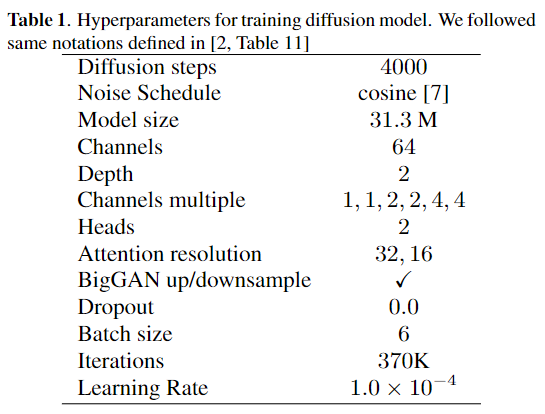

# Detail settings of pre-training configurations
In this page, we explain the more detailed settings of the training configurations of the pre-trained diffusion model. 

The implementation of our method and the network architecture of the pre-trained diffusion model were mostly based on [the code provided by the authors of the DDRM paper](https://github.com/bahjat-kawar/ddrm) [1].
We slightly modified some parts as follows. 
We converted each audio input into a complex-valued STFT representation using a window size of `1024`, a hop size of `256`, and a Hann window.
Further, we cut the direct current component of the input signals and input them as `2`-channeled `512 x 512` image data to follow the original input configurations. The first channel corresponds to the real value and the second to the imaginary value.
We modified [the original U-Net architecture of the pre-trained model used on DDRM](https://github.com/openai/guided-diffusion) [2] by adding a time-distributed fully connected layer [3] to the last layer of every residual block.

For the training, we reduced the size of the diffusion model to have the fewer trainable parameters (`31.3` M), and the training took less than three days using one NVIDIA A100 GPU.
The hyperparameters for the training of the diffusion model are in the following Table 1.
We also incorporate an adaptive group normalization [2] into each residual block.
We train the model using AdamW [4] with $\beta _ {1}=0.9$ and $\beta _ {2}=0.999$ in $16$-bit precision [5]. We use an exponential moving average over model parameters with a rate of `0.9999` [6].

    

# Reference
[1] B. Kawar, M. Elad, S. Ermon, and J. Song, "Denoising diffusion restoration models," in Proceedings of the Advances in Neural Information Processing Systems, 2022.

[2] P. Dhariwal and A. Nichol, "Diffusion models beat GANs on image synthesis," in Advances in Neural Information Processing Systems, 2021, vol. 34, pp. 8780–8794.

[3] W. Choi, M. Kim, J. Chung, D. Lee, and S. Jung, "Investigating U-Nets with various intermediate blocks for spectrogram-based singing voice separation.," in Proceedings of the International Society for Music Information Retrieval Conference, 2020.

[4] I. Loshchilov and F. Hutter, "Decoupled weight decay regularization," in Proceedings of the the International Conference on Learning Representations, 2019.

[5] P. Micikevicius, S. Narang, J. Alben, G. Diamos, E. Elsen, D. Garcia, B. Ginsburg, M. Houston, O. Kuchaiev, G. Venkatesh, and H. Wu, "Mixed precision training," in Proceedings of International Conference on Learning Representations, 2018.

[6] Y. Song and S. Ermon, "Improved techniques for training score-based generative models," in Advances in Neural Information Processing Systems, 2020, vol. 33, pp. 12438–12448.

[7] A. Nichol and P. Dhariwal, "Improved denoising diffusion proba-
bilistic models," arXiv preprint arXiv:2102.09672, 2021.